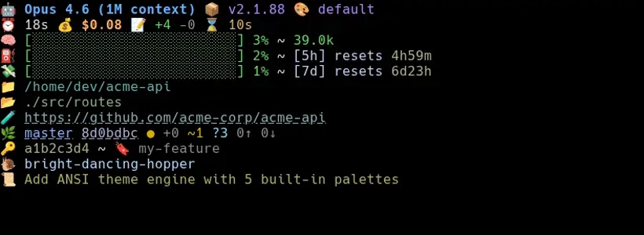

# .3am.statusline

ANSI-colored terminal status line for Claude Code. Model, cost, context, git, rate limits. 5 themes.

> DISCLOSURE. This was created with the help of Claude Code.



## Install

### Option A: Git submodule (recommended)

```bash
git submodule add https://github.com/brianclaridge/.3am.statusline .claude/plugins/brianclaridge/.3am.statusline
```

Then add `--plugin-dir` to your claude invocation:

```bash
claude --plugin-dir .claude/statusline
```

Add to `.claude/settings.json`:

```json
{
  "statusLine": {
    "type": "command",
    "command": "cd \"$CLAUDE_PROJECT_DIR/.claude/statusline\" && uv run src/statusline.py",
    "padding": 2
  }
}
```

### Option B: Standalone clone

```bash
git clone https://github.com/brianclaridge/.3am.statusline /path/to/statusline
claude --plugin-dir /path/to/statusline
```

Add to `settings.json` (user or project):

```json
{
  "statusLine": {
    "type": "command",
    "command": "cd /path/to/.3am.statusline && uv run src/statusline.py",
    "padding": 2
  }
}
```

### Option C: GitHub marketplace

```bash
/plugin marketplace add brianclaridge/.3am.statusline
/plugin install statusline@3am.bot
```

Then add the `statusLine` command to `settings.json`. The plugin is cached at `~/.claude/plugins/cache/`, so use `${CLAUDE_PLUGIN_ROOT}`:

```json
{
  "statusLine": {
    "type": "command",
    "command": "cd \"${CLAUDE_PLUGIN_ROOT}\" && uv run src/statusline.py",
    "padding": 2
  }
}
```

## Themes

5 built-in: `default`, `dracula`, `gruvbox`, `nord`, `tokyo`

```bash
/statusline:theme              # interactive picker (requires --plugin-dir)
uv run src/set_theme.py        # list themes
uv run src/set_theme.py tokyo  # set directly
```

## Test

```bash
cat example.json | uv run src/statusline.py
```
